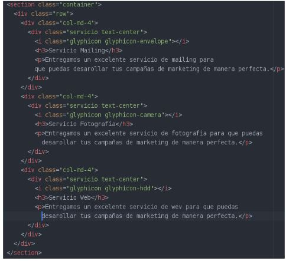
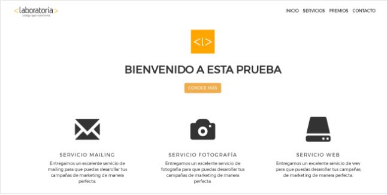

# Laboratoria Services

## Descripción del Proyecto
---------------------------
El presente proyecto consiste en mostrar los servicios que brinda Laboratoria a través de un diseño que permita al usuario contar con la información necesaria de cada servicio. 

## Reto del proyecto
--------------------
Este proyecto tiene como reto utilizar las clases del Framework Bootstrap, con el objetivo de maquetar el layout de manera rápiday eficaz.
Para ello enlazamos la dependencia bootstrap a nuestro proyecto a través de los links correspondientes y así utilizar los componentes según los requerimientos.

### Clases Boostrap utilizadas
-------------------------------
	-Container
	-row
	-col-md-4
	-text-center
	-glyphicon

Como se ve en el navegador:

## Autor: Lourdes Vílchez
